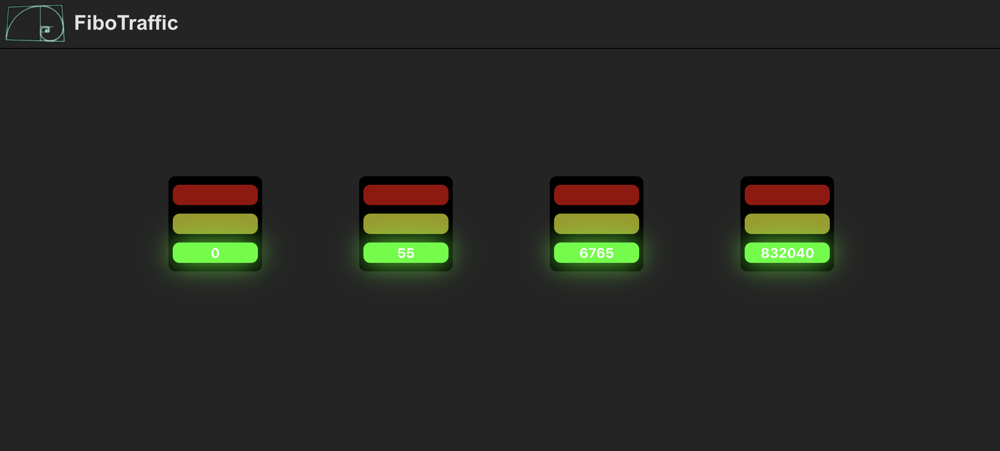

# FiboTraffic

This project is a React application that visualizes Fibonacci number calculations using traffic light components.

## Key Features

- Traffic light component with three states: stopped, calculating, and complete.
- Fibonacci calculation integrated into traffic light state transitions.
- Each traffic light performs 10 Fibonacci calculations and cycles back to the stopped state.
- Responsive design: traffic lights align horizontally and wrap to a new row if the screen is small.
- Four traffic lights with different starting points for Fibonacci calculations.

## Prerequisites

Node.js and npm installed on your machine.

## Installation

- Clone the repository
- Navigate to the project directory: `cd FiboTraffic`
- Install dependencies: `npm install`
- Running the Application: `npm run dev`
- Open your browser and go to http://localhost:5173/

## Design

### Components directory tree structure

It was choosen to follow an atomic design structure where:

- Atoms: Small, reusable components.

- Molecules: Slightly more complex components made of atoms.

- Organisms: Groups of molecules to form complete sections.

Therefore, our Component tree would look like:

```
components
|__ atoms
        |__light
    molecules
        |__button
        |__header
        |__trafficLight
    organisms
        |__trafficLightGroup
```

### Fibonacci calculation

For the fibonacci calculation it was decided to create a custom hook (useFibonacci) so it can be used along the code.

```
export function useFibonacci() {
  const [result, setResult] = useState<number | null>(null);
  const [isCalculating, setIsCalculating] = useState<boolean>(false);

  const fibonacci = (n: number): number => {
    if (n <= 1) return n;

    let previousNumber = 0,
      currentValue = 1,
      pivot = 0;

    for (let fibonacciIndex = 2; fibonacciIndex <= n; fibonacciIndex++) {
      pivot = currentValue + previousNumber;
      previousNumber = currentValue;
      currentValue = pivot;
    }
    return currentValue;
  };

  const fibonacciCalculation = (n: number) => {
    setIsCalculating(true);

    const fibResult = fibonacci(n);
    setResult(fibResult);
    setIsCalculating(false);
  };

  return { result, isCalculating, fibonacciCalculation };
}
```

### Optimization

To optimize Fibonacci calculations for large numbers I've changed the implementation to a linear (O(n)) one:

```
const fibonacci = (n: number): number => {
    if (n <= 1) return n;

    let previousNumber = 0,
      currentValue = 1,
      pivot = 0;

    for (let fibonacciIndex = 2; fibonacciIndex <= n; fibonacciIndex++) {
      pivot = currentValue + previousNumber;
      previousNumber = currentValue;
      currentValue = pivot;
    }
    return currentValue;
  };
```

The previous one is is exponential complexity (O(2^n)) that's a expensive implememntation for larger numbers

```
 function fibonacci(n) {
       if (n <= 1) return n;
       return fibonacci(n - 1) + fibonacci(n - 2);
  }
```

### Interface


